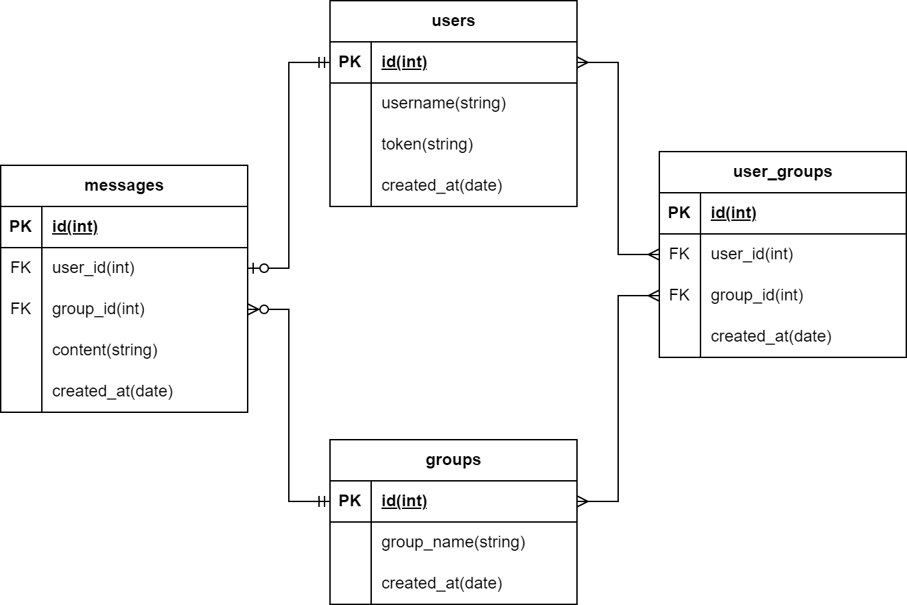

# Database Documentation

This document describes the database schema and setup for the Chat Application Backend.

---

## Schema Overview

The database consists of four tables:

1. **`users`**: Stores user information.
2. **`groups`**: Stores chat group information.
3. **`user_groups`**: Manages the many-to-many relationship between users and groups.
4. **`messages`**: Stores messages sent by users in groups.

---

## Table Details

### 1. `users`
- **Fields**:
    - `id` (Primary Key): Unique identifier for the user.
    - `username`: Unique username of the user.
    - `token`: Unique token for user identification.
    - `created_at`: Timestamp when the user was created.

### 2. `groups`
- **Fields**:
    - `id` (Primary Key): Unique identifier for the group.
    - `group_name`: Unique name of the group.
    - `created_at`: Timestamp when the group was created.

### 3. `user_groups`
- **Fields**:
    - `id` (Primary Key): Unique identifier for the relationship.
    - `user_id`: Foreign key referencing the `users` table.
    - `group_id`: Foreign key referencing the `groups` table.
    - `created_at`: Timestamp when the relationship was created.

### 4. `messages`
- **Fields**:
    - `id` (Primary Key): Unique identifier for the message.
    - `user_id`: Foreign key referencing the `users` table.
    - `group_id`: Foreign key referencing the `groups` table.
    - `content`: Content of the message.
    - `created_at`: Timestamp when the message was sent.

---

## Entity-Relation Diagram


---

## Initialization

1. Initialize the database:
   ```bash
   sqlite3 database/chat.db < database/schema.sql

2. Insert dummy data (optional, but must initiate the database first)
   ```bash
   sqlite3 database/chat.db < database/dummy_data.sql